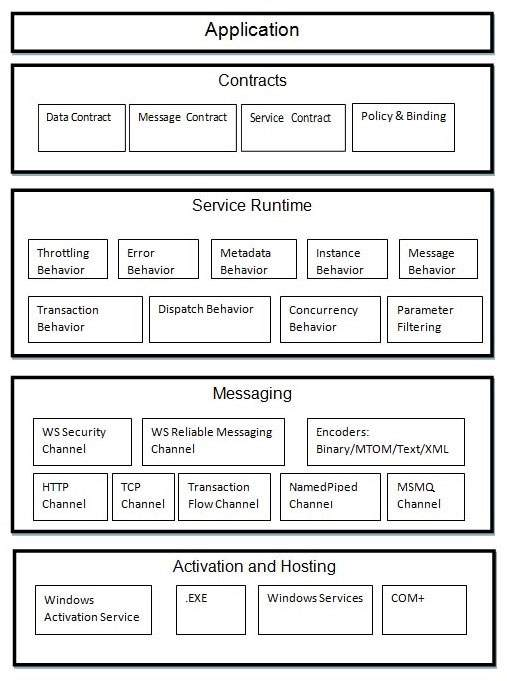

# WCF - Architecture

## Contracts

The contracts layer is just next to the application layer and contains information similar to that of a real-world contract that specifies the operation of a service and the kind of accessible information it will make. Contracts are basically of four types discussed below in brief −

- **Service contract** − This contract provides information to the client as well as to the outer world about the offerings of the endpoint, and the protocols to be used in the communication process.
- **Data contract** − The data exchanged by a service is defined by a data contract. Both the client and the service has to be in agreement with the data contract.
- **Message contract** − A data contract is controlled by a message contract. It primarily does the customization of the type formatting of the SOAP message parameters. Here, it should be mentioned that WCF employs SOAP format for the purpose of communication. SOAP stands for Simple Object Access Protocol.
- **Policy and Binding** − There are certain pre-conditions for communication with a service, and such conditions are defined by policy and binding contract. A client needs to follow this contract.

## Service Runtime

The service runtime layer is just below the contracts layer. It specifies the various service behaviors that occur during runtime. There are many types of behaviors that can undergo configuration and come under the service runtime.

- **Throttling Behavior** − Manages the number of messages processed.
- **Error Behavior** − Defines the result of any internal service error occurrence.
- **Metadata Behavior** − Specifies the availability of metadata to the outside world.
- **Instance Behavior** − Defines the number of instances that needs to be created to make them available for the client.
- **Transaction Behavior** − Enables a change in transaction state in case of any failure.
- **Dispatch Behavior** − Controls the way by which a message gets processed by the infrastructure of WCF.
- **Concurrency Behavior** − Controls the functions that run parallel during a client-server communication.
- **Parameter Filtering** − Features the process of validation of parameters to a method before it gets invoked.

## Messaging

This layer, composed of several channels, mainly deals with the message content to be communicated between two endpoints. A set of channels form a channel stack and the two major types of channels that comprise the channel stack are the following ones −

- **Transport Channels** − These channels are present at the bottom of a stack and are accountable for sending and receiving messages using transport protocols like HTTP, TCP, Peer-to-Peer, Named Pipes, and MSMQ.
- **Protocol Channels** − Present at the top of a stack, these channels also known as layered channels, implement wire-level protocols by modifying messages.

## Activation and Hosting

The last layer of WCF architecture is the place where services are actually hosted or can be executed for easy access by the client. This is done by various mechanisms discussed below in brief.

- **IIS** − IIS stands for Internet Information Service. It offers a myriad of advantages using the HTTP protocol by a service. Here, it is not required to have the host code for activating the service code; instead, the service code gets activated automatically.
- **Windows Activation Service** − This is popularly known as WAS and comes with IIS 7.0. Both HTTP and non-HTTP based communication is possible here by using TCP or Namedpipe protocols.
- **Self-hosting** − This is a mechanism by which a WCF service gets self-hosted as a console application. This mechanism offers amazing flexibility in terms of choosing the desired protocols and setting own addressing scheme.
- **Windows Service** − Hosting a WCF service with this mechanism is advantageous, as the services then remain activated and accessible to the client due to no runtime activation.

