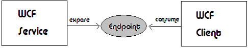
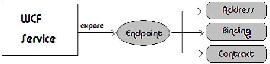
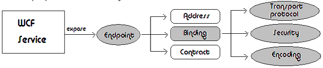

A WCF service allows communication through an Endpoint. And the endpoint is the only point of communication of the WCF service that enables message exchange with the client 

And this Endpoint needs to set the ABC attributes of the WCF service 

## So, what is the Binding?

The Binding is an attribute of an endpoint and it lets you configure transport protocol, encoding and security requirements 

## What a Binding Defines

The information in a binding can be very basic, or very complex. The most basic binding specifies only the transport protocol (such as HTTP) that must be used to connect to the endpoint. More generally, the information a binding contains about how to connect to an endpoint falls into one of the following categories:

**Protocols**
Determines the security mechanism being used: either reliable messaging capability or transaction context flow settings.

**Encoding**
Determines the message encoding (for example, text or binary).

**Transport**
Determines the underlying transport protocol to use (for example, TCP or HTTP).

## The Elements of a Binding

A binding basically consists of an ordered stack of binding elements, each of which specifies part of the communication information required to connect to a service endpoint. The two lowest layers in the stack are both required. At the base of the stack is the transport binding element and just above this is the element that contains the message encoding specifications. The optional binding elements that specify the other communication protocols are layered above these two required elements. For more information about these binding elements and their correct ordering, see [Custom Bindings](https://docs.microsoft.com/en-us/dotnet/framework/wcf/extending/custom-bindings).

## System-Provided Bindings

The information in a binding can be complex, and some settings may not be compatible with others. For this reason, WCF includes a set of system-provided bindings. These bindings are designed to cover most application requirements. The following classes represent some examples of system-provided bindings:

- [BasicHttpBinding](https://docs.microsoft.com/en-us/dotnet/api/system.servicemodel.basichttpbinding): An HTTP protocol binding suitable for connecting to Web services that conforms to the WS-I Basic Profile specification (for example, ASP.NET Web services-based services).
- [WSHttpBinding](https://docs.microsoft.com/en-us/dotnet/api/system.servicemodel.wshttpbinding): An interoperable binding suitable for connecting to endpoints that conform to the WS-* protocols.
- [NetNamedPipeBinding](https://docs.microsoft.com/en-us/dotnet/api/system.servicemodel.netnamedpipebinding): Uses the .NET Framework to connect to other WCF endpoints on the same machine.
- [NetMsmqBinding](https://docs.microsoft.com/en-us/dotnet/api/system.servicemodel.netmsmqbinding): Uses the .NET Framework to create queued message connections with other WCF endpoints.
- [NetTcpBinding](https://docs.microsoft.com/en-us/dotnet/api/system.servicemodel.nettcpbinding): This binding offers higher performance than HTTP bindings and is ideal for use in a local network.

For a complete list, with descriptions, of all the WCF-provided bindings, see [System-Provided Bindings](https://docs.microsoft.com/en-us/dotnet/framework/wcf/system-provided-bindings).

The following bindings ship with WCF:

| Binding                                                      | Configuration Element                                        | Description                                                  |
| :----------------------------------------------------------- | :----------------------------------------------------------- | :----------------------------------------------------------- |
| [BasicHttpBinding](https://docs.microsoft.com/en-us/dotnet/api/system.servicemodel.basichttpbinding) | [basicHttpBinding](https://docs.microsoft.com/en-us/dotnet/framework/configure-apps/file-schema/wcf/basichttpbinding) | A binding that is suitable for communicating with WS-Basic Profile-conformant Web services, for example, ASP.NET Web services (ASMX)-based services. This binding uses HTTP as the transport and text/XML as the default message encoding. |
| [WSHttpBinding](https://docs.microsoft.com/en-us/dotnet/api/system.servicemodel.wshttpbinding) | [wsHttpBinding](https://docs.microsoft.com/en-us/dotnet/framework/configure-apps/file-schema/wcf/wshttpbinding) | A secure and interoperable binding that is suitable for non-duplex service contracts. |
| [WSDualHttpBinding](https://docs.microsoft.com/en-us/dotnet/api/system.servicemodel.wsdualhttpbinding) | [wsDualHttpBinding](https://docs.microsoft.com/en-us/dotnet/framework/configure-apps/file-schema/wcf/wsdualhttpbinding) | A secure and interoperable binding that is suitable for duplex service contracts or communication through SOAP intermediaries. |
| [WSFederationHttpBinding](https://docs.microsoft.com/en-us/dotnet/api/system.servicemodel.wsfederationhttpbinding) | [wsFederationHttpBinding](https://docs.microsoft.com/en-us/dotnet/framework/configure-apps/file-schema/wcf/wsfederationhttpbinding) | A secure and interoperable binding that supports the WS-Federation protocol, which enables organizations that are in a federation to efficiently authenticate and authorize users. |
| [NetHttpBinding](https://docs.microsoft.com/en-us/dotnet/api/system.servicemodel.nethttpbinding) | [netHttpBinding](https://docs.microsoft.com/en-us/dotnet/framework/configure-apps/file-schema/wcf/nethttpbinding) | A binding designed for consuming HTTP or WebSocket services that uses binary encoding by default. |
| [NetHttpsBinding](https://docs.microsoft.com/en-us/dotnet/api/system.servicemodel.nethttpsbinding) | [netHttpsBinding](https://docs.microsoft.com/en-us/dotnet/framework/configure-apps/file-schema/wcf/nethttpsbinding) | A secure binding designed for consuming HTTP or WebSocket services that uses binary encoding by default. |
| [NetTcpBinding](https://docs.microsoft.com/en-us/dotnet/api/system.servicemodel.nettcpbinding) | [netTcpBinding](https://docs.microsoft.com/en-us/dotnet/framework/configure-apps/file-schema/wcf/nettcpbinding) | A secure and optimized binding suitable for cross-machine communication between WCF applications. |
| [NetNamedPipeBinding](https://docs.microsoft.com/en-us/dotnet/api/system.servicemodel.netnamedpipebinding) | [netNamedPipeBinding](https://docs.microsoft.com/en-us/dotnet/framework/configure-apps/file-schema/wcf/netnamedpipebinding) | A secure, reliable, optimized binding that is suitable for on-machine communication between WCF applications. |
| [NetMsmqBinding](https://docs.microsoft.com/en-us/dotnet/api/system.servicemodel.netmsmqbinding) | [netMsmqBinding](https://docs.microsoft.com/en-us/dotnet/framework/configure-apps/file-schema/wcf/netmsmqbinding) | A queued binding that is suitable for cross-machine communication between WCF applications. |
| [NetPeerTcpBinding](https://docs.microsoft.com/en-us/dotnet/api/system.servicemodel.netpeertcpbinding) | [netPeerTcpBinding](https://docs.microsoft.com/en-us/dotnet/framework/configure-apps/file-schema/wcf/netpeertcpbinding) | A binding that enables secure, multiple machine communication. |
| [MsmqIntegrationBinding](https://docs.microsoft.com/en-us/dotnet/api/system.servicemodel.msmqintegration.msmqintegrationbinding) | [msmqIntegrationBinding](https://docs.microsoft.com/en-us/dotnet/framework/configure-apps/file-schema/wcf/msmqintegrationbinding) | A binding that is suitable for cross-machine communication between a WCF application and existing Message Queuing applications. |
| [BasicHttpContextBinding](https://docs.microsoft.com/en-us/dotnet/api/system.servicemodel.basichttpcontextbinding) | [basicHttpContextBinding](https://docs.microsoft.com/en-us/dotnet/framework/configure-apps/file-schema/wcf/basichttpcontextbinding) | A binding suitable for communicating with WS-Basic Profile conformant Web services that enables HTTP cookies to be used to exchange context. |
| [NetTcpContextBinding](https://docs.microsoft.com/en-us/dotnet/api/system.servicemodel.nettcpcontextbinding) | [netTcpContextBinding](https://docs.microsoft.com/en-us/dotnet/framework/configure-apps/file-schema/wcf/nettcpcontextbinding) | A secure and optimized binding suitable for cross-machine communication between WCF applications that enables SOAP headers to be used to exchange context. |
| [WebHttpBinding](https://docs.microsoft.com/en-us/dotnet/api/system.servicemodel.webhttpbinding) | [webHttpBinding](https://docs.microsoft.com/en-us/dotnet/framework/configure-apps/file-schema/wcf/webhttpbinding) | A binding used to configure endpoints for WCF Web services that are exposed through HTTP requests instead of SOAP messages. |
| [WSHttpContextBinding](https://docs.microsoft.com/en-us/dotnet/api/system.servicemodel.wshttpcontextbinding) | [wsHttpContextBinding](https://docs.microsoft.com/en-us/dotnet/framework/configure-apps/file-schema/wcf/wshttpcontextbinding) | A secure and interoperable binding suitable for non-duplex service contracts that enables SOAP headers to be used to exchange context. |
| [UdpBinding](https://docs.microsoft.com/en-us/dotnet/api/system.servicemodel.udpbinding) | [udpBinding](https://docs.microsoft.com/en-us/dotnet/framework/configure-apps/file-schema/wcf/udpbinding) | A binding to use when sending a burst of simple messages to a large number of clients simultaneously. |

The following table shows the features of each of the system-provided bindings. The bindings are found in the table columns; the features are listed in the rows and described in a second table. The following table provides a key for the binding abbreviations used. To select a binding, determine which column satisfies all of the row features you need.

| Binding                                                      | Interoperability  | Security (Default)                                           | Session (Default)                               | Transactions | Duplex         | Encoding (Default)   | Streaming (Default) |
| :----------------------------------------------------------- | :---------------- | :----------------------------------------------------------- | :---------------------------------------------- | :----------- | :------------- | :------------------- | :------------------ |
| [BasicHttpBinding](https://docs.microsoft.com/en-us/dotnet/api/system.servicemodel.basichttpbinding) | Basic Profile 1.1 | (None), Transport, Message, Mixed                            | (None)                                          | (None)       | n/a            | Text, (MTOM)         | Yes (buffered)      |
| [WSHttpBinding](https://docs.microsoft.com/en-us/dotnet/api/system.servicemodel.wshttpbinding) | WS                | Transport, (Message), Mixed                                  | (None), Reliable Session, Security Session      | (None), Yes  | n/a            | (Text), MTOM         | No                  |
| [WSDualHttpBinding](https://docs.microsoft.com/en-us/dotnet/api/system.servicemodel.wsdualhttpbinding) | WS                | (Message), None                                              | (Reliable Session), Security Session            | (None), Yes  | Yes            | (Text), MTOM         | No                  |
| [WSFederationHttpBinding](https://docs.microsoft.com/en-us/dotnet/api/system.servicemodel.wsfederationhttpbinding) | WS-Federation     | (Message), Mixed, None                                       | (None), Reliable Session, Security Session      | (None), Yes  | No             | (Text), MTOM         | No                  |
| [NetHttpBinding](https://docs.microsoft.com/en-us/dotnet/api/system.servicemodel.nethttpbinding) | .NET              | (None), Transport, Message, TransportWithMessageCredential, TransportCredentialOnly | See note below                                  | None         | See note below | (Binary), Text, MTOM | Yes (buffered)      |
| [NetHttpsBinding](https://docs.microsoft.com/en-us/dotnet/api/system.servicemodel.nethttpsbinding) | .NET              | (Transport), TransportWithMessageCredential                  | See note below                                  | None         | See note below | (Binary), Text, MTOM | Yes (buffered)      |
| [NetTcpBinding](https://docs.microsoft.com/en-us/dotnet/api/system.servicemodel.nettcpbinding) | .NET              | (Transport), Message, None, Mixed                            | (Transport), Reliable Session, Security Session | (None), Yes  | Yes            | Binary               | Yes (buffered)      |
| [NetNamedPipeBinding](https://docs.microsoft.com/en-us/dotnet/api/system.servicemodel.netnamedpipebinding) | .NET              | (Transport), None                                            | None, (Transport)                               | (None), Yes  | Yes            | Binary               | Yes (buffered)      |
| [NetMsmqBinding](https://docs.microsoft.com/en-us/dotnet/api/system.servicemodel.netmsmqbinding) | .NET              | Message, (Transport), None                                   | (None), Transport                               | None, (Yes)  | No             | Binary               | No                  |
| [NetPeerTcpBinding](https://docs.microsoft.com/en-us/dotnet/api/system.servicemodel.netpeertcpbinding) | Peer              | (Transport)                                                  | (None)                                          | (None)       | Yes            |                      | No                  |
| [MsmqIntegrationBinding](https://docs.microsoft.com/en-us/dotnet/api/system.servicemodel.msmqintegration.msmqintegrationbinding) | MSMQ              | (Transport)                                                  | (None)                                          | None, (Yes)  | n/a            | n/a                  | No                  |
| [BasicHttpContextBinding](https://docs.microsoft.com/en-us/dotnet/api/system.servicemodel.basichttpcontextbinding) | Basic Profile 1.1 | (None), Transport, Message, Mixed                            | (None)                                          | (None)       | n/a            | Text, (MTOM)         | Yes (buffered)      |
| [NetTcpContextBinding](https://docs.microsoft.com/en-us/dotnet/api/system.servicemodel.nettcpcontextbinding) | .NET              | (Transport), Message, None, Mixed                            | (Transport), Reliable Session, Security Session | (None), Yes  | Yes            | Binary               | Yes (buffered)      |
| [WSHttpContextBinding](https://docs.microsoft.com/en-us/dotnet/api/system.servicemodel.wshttpcontextbinding) | WS                | Transport, (Message), Mixed                                  | (None), Reliable Session, Security Session      | (None), Yes  | n/a            | Text, (MTOM)         | No                  |
| [UdpBinding](https://docs.microsoft.com/en-us/dotnet/api/system.servicemodel.udpbinding)  **Note:** Interoperability can be achieved by implementing the standard SOAP-over-UDP spec which this binding implements. | .NET              | (None)                                                       | (None)                                          | (None)       | n/a            | (Text)               | No                  |

 Important

[NetHttpBinding](https://docs.microsoft.com/en-us/dotnet/api/system.servicemodel.nethttpbinding) is a binding designed for consuming HTTP or WebSocket services and uses binary encoding by default. [NetHttpBinding](https://docs.microsoft.com/en-us/dotnet/api/system.servicemodel.nethttpbinding) detects whether it's used with a request-reply contract or duplex contract and changes its behavior to match; it uses HTTP for request-reply and WebSockets for duplex. This behavior can be overridden using the [WebSocketTransportUsage](https://docs.microsoft.com/en-us/dotnet/api/system.servicemodel.channels.websockettransportusage) binding setting: WhenDuplex - This is the default value and behaves as described above. Never - This prevents WebSockets from being used. Attempting to use a duplex contract with this setting results in an exception. Always - This forces WebSockets to be used even for request-reply contracts. NetHttpBinding supports reliable sessions in both HTTP mode and WebSocket mode. In WebSocket mode sessions are provided by the transport.

The following table explains the features listed in the previous table.

| Feature               | Description                                                  |
| :-------------------- | :----------------------------------------------------------- |
| Interoperability Type | Names the protocol or technology with which the binding ensures interoperation. |
| Security              | Specifies how the channel is secured: - None: The SOAP message isn't secured and the client isn't authenticated. - Transport: Security requirements are satisfied at the transport layer. - Message: Security requirements are satisfied at the message layer. - Mixed: Claims are carried in the message; integrity and confidentiality requirements are satisfied by the transport layer. |
| Session               | Specifies whether this binding supports session contracts.   |
| Transactions          | Specifies whether transactions are enabled.                  |
| Duplex                | Specifies whether duplex contracts are supported. Note that this feature requires support for Sessions in the binding. |
| Encoding              | Specifies the wire format of the message. Allowable values include: - Text: for example UTF-8. - Binary - Message Transmission Optimization Mechanism (MTOM): A method for efficiently encoding binary XML elements within the context of a SOAP envelope. |
| Streaming             | Specifies whether streaming is supported for incoming and outgoing messages. Use the `TransferMode` property on the binding to set the value. The allowable values include: - [Buffered](https://docs.microsoft.com/en-us/dotnet/api/system.servicemodel.transfermode#System_ServiceModel_TransferMode_Buffered): The request and response messages are both buffered. - [Streamed](https://docs.microsoft.com/en-us/dotnet/api/system.servicemodel.transfermode#System_ServiceModel_TransferMode_Streamed): The request and response messages are both streamed. - [StreamedRequest](https://docs.microsoft.com/en-us/dotnet/api/system.servicemodel.transfermode#System_ServiceModel_TransferMode_StreamedRequest): The request message is streamed and the response message is buffered. - [StreamedResponse](https://docs.microsoft.com/en-us/dotnet/api/system.servicemodel.transfermode#System_ServiceModel_TransferMode_StreamedResponse): The request message is buffered and the response message is streamed. |

