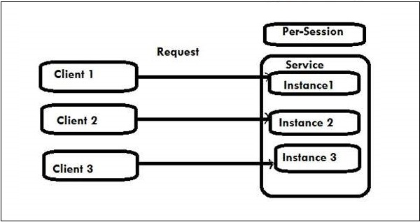
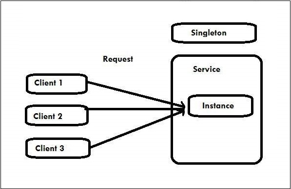

# Instance Management

The set of techniques employed by WCF for binding a set of messages (client requests) to service instances is known as Instance Management. WCF supports three types of instance activation and they are discussed in this chapter.

## Per-Call Service

Per-call service is the default instance activation mode of WCF. When a WCF service is configured for a per-call service, a CLR object is created for the timespan a client call or request is in progress. CLR stands for Common Language Runtime and it includes service instances in WCF.

In per-call service, every client request achieves a new dedicated service instance and its memory consumption is less as compared to other types of instance activation.

The InstanceContextMode property is required to be set to InstanceContextMode.PerCall, in order to indicate a WCF service to act as a per-call service. The InstanceContextMode property belongs to the ServiceBehavior attribute. Hence, a per-call service can be configured as follows −

```c#
[ServiceContract]
interface IMyContract
{...}
[ServiceBehavior (InstanceContextMode = InstanceContextMode.PerCall)]
class MyService : IMyContract
{...} 
```

A service is here expressed as IMyContract. The following figure shows the process of per-call service instance activation.


**Implementing a Per-Call Service**

```C#
[DataContract]
class Param {....}

[ServiceContract]
interface IMyContract {
   [OperationContract]
   void MyMethod(Param objectIdentifier);
}
class MyPerCallService : IMyContract, IDisposable {
   public void MyMethod(Param objectIdentifier) {
      GetState(objectIdentifier); 
      DoWork();
      SaveState(objectIdentifier);
   }
   
   void GetState(Param objectIdentifier) {....}
   void DoWork() {....}
   void SaveState(Param objectIdentifier) {....}
   public void Dispose() {....}
}
```

## Per-Session Service

In this activation mode of WCF, a private or we can say a confidential session is maintained between the two entities, i.e., the client and a particular service instance. Also known as the private session service, the per-session service offers a new service instance which remains dedicated to each client request and autonomous of all the other instances pertaining to that session-aware service.

To initiate a per-session service, the InstanceContextMode property is required to set to PerSession. Here, the service instance stays in memory all through the session duration.

The activation mode suffers from scalability as the configured service is unable to support any additional outstanding clients other than a few (or maybe up to some hundred) because of the cost involved in each of this dedicated service instance.

```c#
[ServiceBehavior (InstanceContextMode = InstanceContextMode.PerSession)]
class MyService : IMyContract
{...}
```

The process of per-session service



```C#
//Service code
[ServiceContract(Session = true)]
interface IMyContract {
   [OperationContract]
   void MyMethod();
}

[ServiceBehavior(InstanceContextMode = InstanceContextMode.PerSession)]
class MyService : IMyContract, IDisposable {
   int m_Counter = 0; MyService() {Console.WriteLine("MyService.MyService()"); }
   
   public void MyMethod() {
      m_Counter++;
      Console.WriteLine("Counter = " + m_Counter);
   }
   public void Dispose() { 
      Console.WriteLine("MyService.Dispose()"); 
   }
}


//Client Code
MyContractProxy proxy = new MyContractProxy(); proxy.MyMethod(); proxy.MyMethod(); 
proxy.Close();


//Output
MyService.MyService() Counter = 1 Counter = 2 MyService.Dispose()
```


## Singleton Service

In this activation mode of WCF, all client requests independent to each other get connected to the same well-known single instance, irrespective of their connection to the service endpoints. The singleton service gets disposed only when the host closes down.

This service is created just for once when the host is created. In case, the host is not provided with any singleton instance, the service returns as NULL. The activation mode is at its best when the work amount in each method call is little and no pending operations are there in the background.

The InstanceContextMode property is required to set to InstanceContextMode.Single to initiate this Singleton service.



```C#
//Service Code
[ServiceContract]
interface IMyContract {
   [OperationContract]
   void MyMethod( );
}
[ServiceBehavior(InstanceContextMode = InstanceContextMode.Single)]
class MySingleton : IMyContract {
   int m_Counter = 0;
   
   public int Counter {
      get {
         return m_Counter;
      }
      set {
         m_Counter = value;
      }
   }
   public void MyMethod( ) {
      m_Counter++;
      Trace.WriteLine("Counter = " + Counter);
   }
}

//Host Code
MySingleton singleton = new MySingleton( );
singleton.Counter = 42;
ServiceHost host = new ServiceHost(singleton);
host.Open( );

//Do some blocking calls then
host.Close( );


//Client Code
MyContractClient proxy = new MyContractClient( );
proxy.MyMethod( );
proxy.Close( );


//Output
Counter = 43

```

